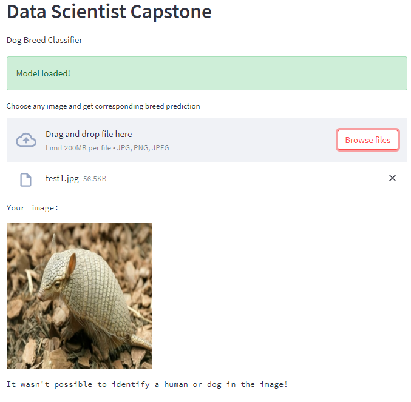

# Dog Breed Classifier Web App

## Udacity Data Scientist Nanodegree Capstone Project

# Table of Contents

1. [Project Movivation](#project_movivation)
2. [Instructions:](#instructions)
3. [File Description](#file-desc)
4. [Analysis](#analysis)
5. [Conclusion](#conclusion)

## Project Movivation

In this project, I uses Convolutional Neural Networks (CNNs) to build a pipeline to solve real-world image classification task. CNNs are one of the most popular methor to analyse image data. This project build CNN from scratch and use transfer learning, which is a technique that allows us use pretrain model, bring many advantages such as saving training time, better performance of neural networks. The objective of this project is given an image, model will classify if it a dog or a human, and estimate of the canine’s breed. If the model can't identify the image as a human or dog, it will let user know. This project also provide a web app for demo.

### Instructions

1. Clone this repository.

    ```
    git clone https://github.com/DoLamTruong/dog_breed
    ```

2. Install the python packages using requirements.txt using:

    ```
    pip install -r requirements.txt
    ```

3. To run web app use the following command:

    ```
    streamlit run app.py
    ```

4. Link web app demo is here[here](https://dolamtruong-dog-breed-app-ew8pjm.streamlitapp.com/)

# File Description

* Haarcascades: Xml file for use with the OpenCv face detector class.

* Saved_models: where best model saved after train.


* images: folder of image files for the markdown file and inference.

* dog_app.ipynb: notebook preprocess, analyze, train and inference.

* model_dog.py: model to inference in web app demo.

* app.py: web app.

* extract_bottleneck_features: extract bottleneck features from pretrain model.

* requirements.txt: Python packages.

## Problem Statement

Web app use an algorithm take an image as input and then determines whether the image contains a human, dog, or neither. After that:

* If a dog is detected, continue predicte its breed.  

* If a human is detected, continue predicte its breed.  

* If neither is detected, return none.  

### The following steps is used to solve the problem

* [Step 0](#step0): Import Datasets
* [Step 1](#step1): Detect Humans
* [Step 2](#step2): Detect Dogs
* [Step 3](#step3): Create a CNN to Classify Dog Breeds (from Scratch)
* [Step 4](#step4): Use a CNN to Classify Dog Breeds (using Transfer Learning)
* [Step 5](#step5): Create a CNN to Classify Dog Breeds (using Transfer Learning)
* [Step 6](#step6): Write your Algorithm
* [Step 7](#step7): Test Your Algorithm

### Solution

The expected solution will be a web application that can do the following things

1. Users can upload an image from the computer.
2. If a dog is detected, it'll show the predicted breed and notify it a dog.
3. If a human is detected, it'll show the predicted breed and notify it a human.
4. If neither is detected in the image, it'll also notify.

### Metrics

Accuracy is used to as a metric to measure of model performance and to choose the best model.

# Analysis

### Dog Images

There are 133 total dog categories.
There are 8351 total dog images.

There are 6680 training dog images.
There are 835 validation dog images.
There are 836 test dog images.

### Human Images

There are 13233 total human images.

## Human Detector Performance

Use OpenCV's implementation of Haar feature-based cascade classifiers to detect human faces in images.

100% percent of the first 100 images in human dataset have a detected human face. 11% percent of the first 100 images in dog dataset have a detected human face

## Dog Detector Performance

I've used a pre-trained InceptionV3 model to detect dogs in images.

0.0 percentage of the images in human_files_short have a detected dog. 100.0 percentage of the images in dog_files_short have a detected dog

## Model Performance

CNN built from scratch achieved a test performance of 1.11%.

THE pre-trained VGG-16 CNN model achieved a test accuracy of 45%.

CNN to Classify Dog Breeds using InceptionV3 (pretrained ImageNet) achieved a test accuracy of 79.7%.


Among the 3 models, InceptionV3 achieved best performance. It will be use to deploy in the web app.

# Conclusion

### Reflection  

1. This web app first uses an algorithm to detect human, dog or neighther. 
2. For dog breed classification, pre-trained InceptionV3 model is used.
3. In the web app, Streamlit is use as a main library, make it easier to deploy machine learning model.
4. User uploads an image file on the app home page.
5. When a dog breed is detected it shows the dog breed information.
6. When a human face is detected it shows the human face resembling dog breed.
7. For anything else it shows message.

#### Web App Pages result

Home page  


Predict a dog picture  


Predict a human picture  


Predict not a human nor dog picture  


## Improvement

1. Augmentation data
2. Using better classification model (pretrain ConvNext, EfficientNet)
3. Using better object dectection model (Yolov5)
