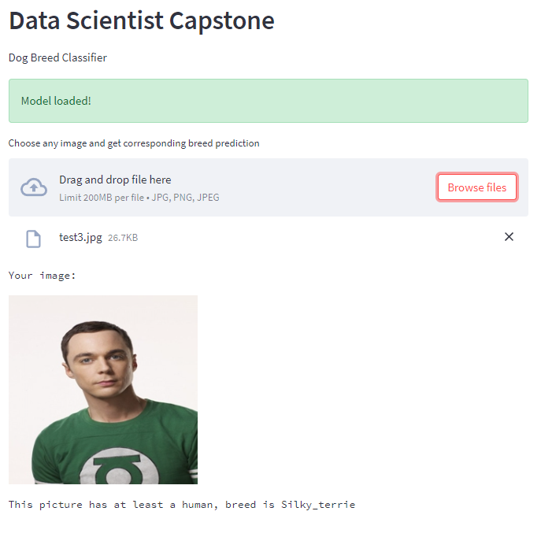

# Dog Breed Classifier Web App

## Udacity Data Scientist Nanodegree Capstone Project

# Table of Contents

1. [Project Movivation](#project_movivation)
2. [Instructions:](#instructions)
3. [File Description](#file-desc)
4. [Analysis](#analysis)
5. [Conclusion](#conclusion)

## Project Movivation

In this project, I uses Convolutional Neural Networks (CNNs) to build a pipeline to solve image classification task. CNNs are one of the most popular methor to analyse image data. This project build CNN from scratch and use transfer learning, which is a technique that allows us use pretrain model, bring many advantages such as saving training time, better performance of neural networks. The objective of this project is given an image, model will classify if it a dog or a human, and estimate of the canine’s breed. If the model can't identify the image as a human or dog, it will let user know.

### Instructions

1. Clone this repository.

    ```
    git clone https://github.com/thekael99/project_4
    ```

2. Install the python packages using requirements.txt using:

    ```
    pip install -r requirements.txt
    ```

3. cd root project folder directory.

4. To run web app use the following command:

    ```
    streamlit run app.py
    ```

5. The app will be running on [local_app](http://localhost:8501)

Or you can use [online_app](https://thekael99-project-4-app-6vnx5s.streamlitapp.com) to demo project instead of run on local machine.

# File Description

requirements.txt: Python packages.

dog_app.ipynb: notebook preprocess, analyze, train and inference.

dog_app.ipynb: jupyter notebook of dog breed classifier.

dog_app.py: dog_app.ipynb convert to script python.

app.py: web app implement using streamlit.

images: folder of image files for the markdown file and inference.


## Problem Statement

For our web app, we've to write an algorithm that accepts a file path to an image and first determines whether the image contains a human, dog, or neither. Then,

1. If a dog is detected in the image, return the predicted breed.

2. If a human is detected in the image, return the resembling dog breed.

3. If neither is detected in the image, provide an output that indicates an error.

### Strategy for solving the problem

1. Build Humans and Dog detectors from the image.
2. Create a CNN to Classify Dog Breeds (from Scratch)
3. Use a CNN to Classify Dog Breeds (using Transfer Learning)
4. Create a CNN to Classify Dog Breeds (using Transfer Learning)
5. Choose the best CNN model for classification.
6. Write your Algorithm to detect dog breed or resembling dog breed or return an error.
7. Test the Algorithm.
8. Export the best model.
9. Build a streamlit web app using the model.
10. Test the model.

### Solution

The expected solution will be a web application that can do the following things

1. Users can upload an image from the computer.
2. If a dog is detected in the image, it'll show the predicted breed.
3. If a human is detected in the image, it'll show the resembling dog breed.
4. If neither is detected in the image, it'll show an error.
5. If the prediction fails, it will show a message to user.

### Metrics

I choose Accuracy as a measure of model performance. Based on the highest test accuracy model, I build the web app and algorithm.

# Analysis

### Dog Images

There are 133 total dog categories.
There are 8351 total dog images.

There are 6680 training dog images.
There are 835 validation dog images.
There are 836 test dog images.

### Human Images

There are 13233 total human images.

## Human Detector Performance

Use OpenCV's implementation of Haar feature-based cascade classifiers to detect human faces in images.

100% percent of the first 100 images in human_files have a detected human face. 11% percent of the first 100 images in dog_files have a detected human face

## Dog Detector Performance

I've used a pre-trained ResNet-50 model to detect dogs in images.

0.0 percentage of the images in human_files_short have a detected dog. 100.0 percentage of the images in dog_files_short have a detected dog

## Model Performance

CNN from scratch has a test performance of 5%.

THE pre-trained VGG-16 CNN model has a test accuracy of 40%.

CNN to Classify Dog Breeds using Resnet50(using transfer Learning) has a test accuracy of 80%.

Among the 3 models, CNN to Classify Dog Breeds using Resnet50 has the best performance. We'll use it to build our Algorithm for the web app.

# Conclusion

## Reflection

### Summary

1. This web app uses dog_detector() for dog detection and face_detector() for face detection.
2. For dog breed detection CNN model with a pre-trained Resnet50 model is used.
3. In the treamlit web app, use predict_human_dog() function to predict dog breed or resembling dog breed.
4. User uploads an image file on the app home page.
5. After uploading the user clicks on the Detect Npw button.
6. When a dog breed is detected it shows the dog breed information.
7. When a human face is detected it shows the human face resembling dog breed.
8. For anything else it shows message.

#### Web App Pages result

Home page


Predict a dog picture


Predict a human picture


## Improvement

1. Augmentation data
2. Using better object detection model (Yolo)
3. Tuning model with more layer instead of 1 Dense layer
4. Decorate app UI
